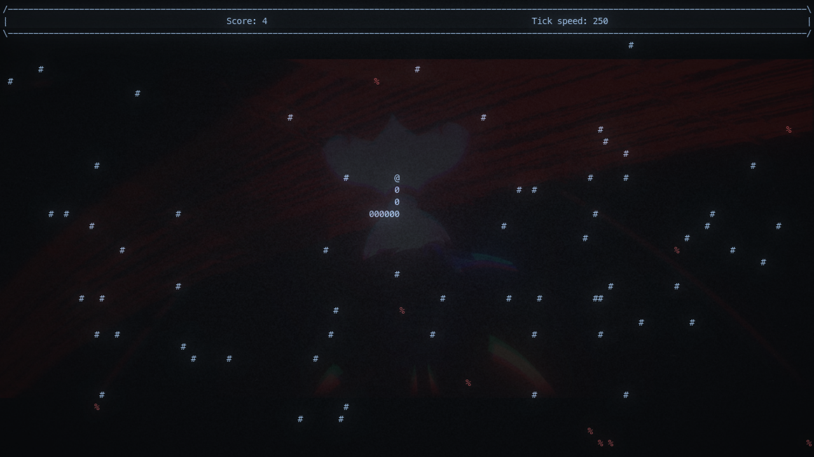
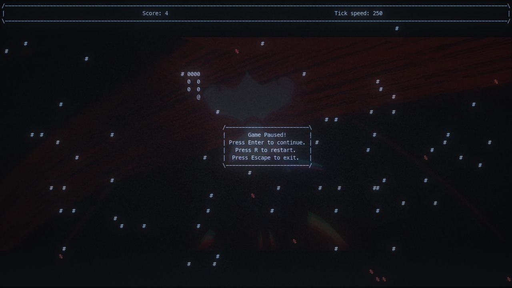
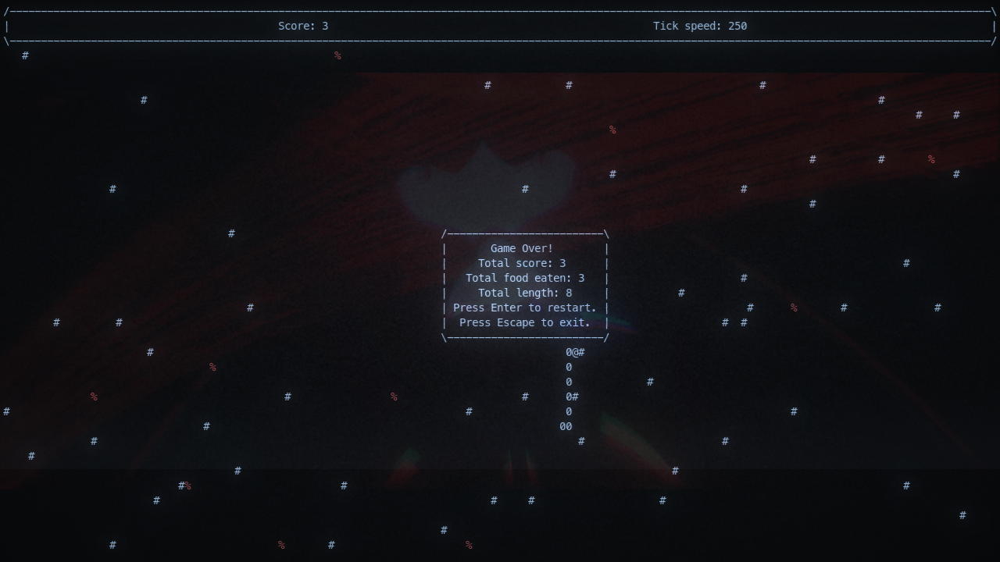
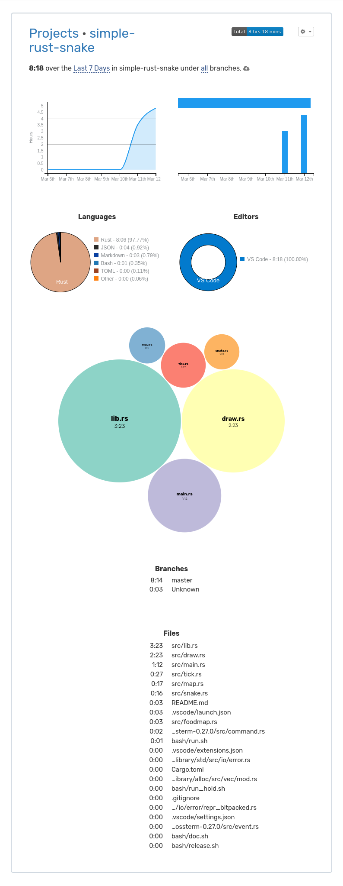

# simple-rust-snake
This is my first project written in rust. It use only crossterm and fastrand. Believing wakatime i wasted 8 hours, 18 minutes on this. As the title says its a simple rust snake.
### Screenshots (Cool retro term was used)

